# Instalación de Git en Ubuntu 20.04
**Índice**

1. [Introducción](#1)
2. [Instalación de Git](#2)
3. [Configuración de Git](#3)

## Introducción<a name="1"></a>
<div align="center">
 

 
</div>

Git es un software de control de repositorios para el mantenimiento de versiones de aplicaciones que contengan un gran número de archivos con código fuente.

Está pensado para mantener como historial todos los cambios generados en los archivos y sus soluciones a conflictos. Además para trabajar en grupo y poder llevar los cambios más organizados.


## Instalación de Git<a name="2"></a>

Para comenzar con la instalación de Git, deberemos actualizar los paquetes de nuestra máquina con el siguiente comando:

```
sudo apt update
```

<div align="center">
 
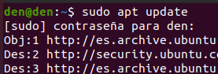
 
</div>

Tomará un poco la descarga, pero una vez finalizada pasaremos a actualizar las librerías que serán necesarias para utilizar Git.

```
sudo apt install libz-dev libssl-dev libcurl4-gnutls-dev libexpat1-dev gettext cmake gcc
```

<div align="center">
 
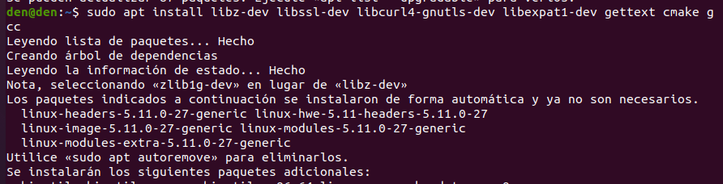
 
</div>

Durante este proceso nos preguntará si queremos continuar y le daremos a la ``s``.

Una vez terminado nos vamos a mover a la carpeta temporal para poder descargar el archivo zip de Git vía online.

```
cd /tmp
```

<div align="center">
 
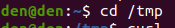
 
</div>

Para poder instalar Git necesitaremos de una herramienta llamada ``curl`` la cual nuestro sistema no tiene previamente instala, por lo cual tendremos que instalarla antes de continuar con el siguiente comando:

```
sudo apt install curl
```

Cuando se haya terminado de instalar podremos seguir al siguiente paso que es descargar desde una fuente online el archivo donde podremos instalar Git.

```
curl -o git.tar.gz https://mirrors.edge.kernel.org/pub/software/scm/git/git-2.29.3.tar.gz
```

Con esta línea de comando lo que estamos pidiendo es que nos descargue desde la url indicada el archivo y lo comprimimos en un nuevo archivo llamado ``git.tar.gz`` 

Este proceso no tomará mucho tiempo en realizarse. 

<div align="center">
 
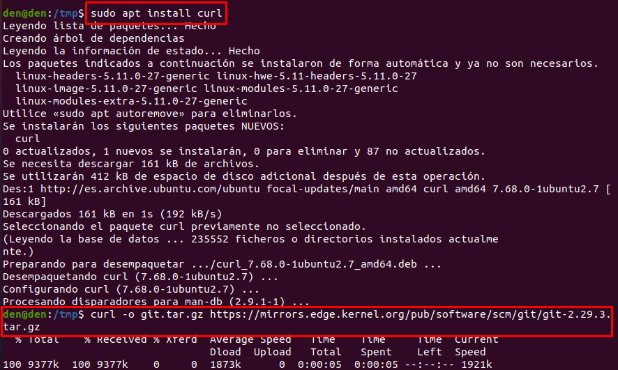
 
</div>

Descomprimiremos el archivo que recién creamos con el siguiente comando:

```
tar -zxf git.tar.gz
```

Luego nos moveremos a la carpeta que se habrá descomprimido, por ende colocaremos solo ``git-*``, indicando con el asterisco que nos mueva a la carpeta que se encuentre en la carpeta tmp con el nombre parecido.

Finalmente utilizaremos el comando  ``make prefix=/usr/local all``

<div align="center">
 
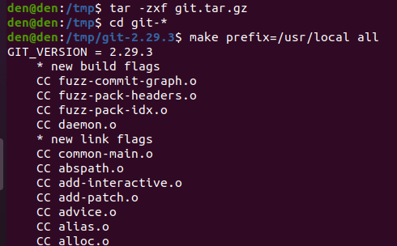
 
</div>


Se tomará un tiempo largo listando todo el contenido descomprimido para luego hacer mas fácil la instalación.

Utilizaremos la misma línea de comando anterior pero le cambiaremos el all por install de manera que quede de la siguiente forma:

```
sudo make prefix=/usr/local install
```

Con esto le estamos indicando que queremos que se instale en la ruta especificada en el ``prefix``.

<div align="center">
 
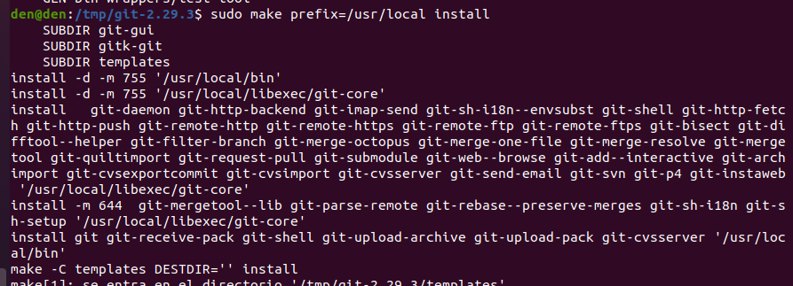
 
</div>

Ahora sustituimos el proceso de shell para utilizar Git.

<div align="center">
 
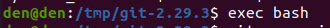
 
</div>

Para comprobar que se ha instalado correctamente la versión de Git, pasaremos el comando ``git --version``

<div align="center">
 
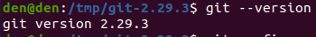
 
</div>

## Configuración de Git<a name="3"></a>

Cuando ya terminemos la instalación de Git, tendremos que configurar tanto el nombre de usuario como el correo electrónico para que lo inserte luego en cada confirmación que realicemos. 

Esto lo podemos realizar de dos maneras, configurando el archivo con el comando ``nano``, o especificándolo con el comando ``git config``.

Utilizando el editor ``nano``, abriremos el archivo con el siguiente comando:

```
nano ~.gitconfig
```

<div align="center">
 
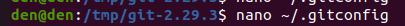
 
</div>

Y luego dentro añadiremos la respectiva información.

<div align="center">
 
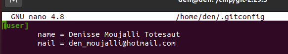
 
</div>

Saldremos dándole a ``ctrl`` + ``w`` y luego a ``y`` para guardar los cambios.

Con ``git config`` es un poco más rápido y no hay que realizar tantos pasos.

Para especificar el nombre de usuario sería:

```
git config --global user.name "tu-nombre”
```

Y para especificar el correo electrónico:

```
git config --global user.email "tunombre@correo.com"
```

Luego para mirar la información en ambos solo bastaría con hacer un ``git config --list``

<div align="center">
 
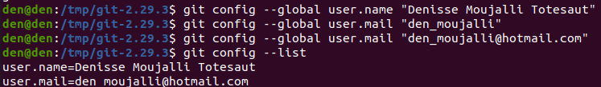
 
</div>

Como se puede ver si tenemos algún error al escribir uno de los apartados bastará con volver a especificarlos para cambiar dicha información.
