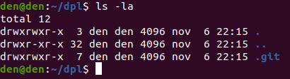
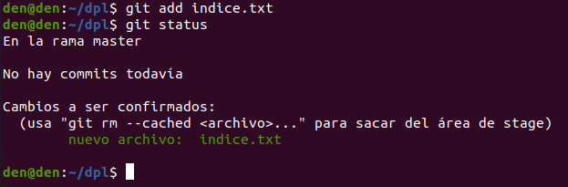

# Manipulación de repositorios en Git
**Índice**

1. [Introducción](#1)
2. [Configuración de parámetros importantes](#2)
3. [Creación del repositorio](#3)
4. [Creación del primer fichero](#4)
5. [Modificación de ficheros](#5)

<div align="justify">
## Introducción<a name="1"></a>
Este tema tiene como objetivo que el lector se familiarice con la creación y manipulación de repositorios en GIT. Para conseguirlo se irán describiendo los pasos necesarios para la realización de cada una de las acciones necesarias.

## Configuración de parámetros importantes<a name="2"></a>

Antes de comenzar a crear nuestro repositorios necesitaremos hacer la configuración más importante, lo que sería especificar el usuario y el correo con el que queremos que se identifique nuestro repositorio, para ello utilizaremos el comando ``git config``.

Primero indicaremos nuestro usuario con el siguiente comando:
```
git config --global user.name “tu nombre completo”
```

Seguido indicaremos el correo electrónico.

```
git config --global user.email “tu correo electronico”
```
Finalmente cambiaremos el color por el automático.
```
git config --global color.ui auto
```

Para visualizar que los parámetros que hemos ingresado se hayan realizado escribiremos git config --list de esta forma nos saldrá un listado con todo lo que hemos configurado.

<div align="center">
 

 
</div>

## Creación del repositorio<a name="3"></a>

Crearemos un nuevo directorio con el nombre dpl.
```
mkdir dpl
```
Y nos moveremos hacia él para poder realizar la creación del repositorio.
```
cd dpl
```
<div align="center">
 

 
</div>

Inicializamos el repositorio con ``git init``.

<div align="center">
 

 
</div>

Listamos el directorio para ver que se ha realizado la inicialización del repositorio.
```
ls -la
```
<div align="center">
 

 
</div>

## Creación del primer fichero<a name="4"></a>

Veremos principalmente el estado del repositorio para luego notar los cambios que vamos haciendo.
```
git status
```
<div align="center">
 

 
</div>

Crearemos el fichero con ``cat`` y añadiremos las primeras líneas en él.
```
cat > indice.txt
Capítulo 1: Instalación de Git por el alumno XXX
Capítulo 2: Flujo de trabajo básico
```
Le daremos a ``ctrl`` + ``D`` cuando ya queramos terminar de editar el fichero.

<div align="center">
 

 
</div>

Miraremos el estado del repositorio, el cual nos dirá que tendremos un archivo que no tiene ningún tipo de seguimiento.

<div align="center">
 

 
</div>

Añadiremos el fichero al repositorio con ``git add indice.txt`` y un ``git status`` para observar si se ha añadido el archivo.

<div align="center">
 

 
</div>

Añadiremos un commit para dejar un mensaje de los cambios realizados y veremos el estado del repositorio.
```
git commit -m "Añadido índice de la asignatura DPL."
git status
```
<div align="center">
 

 
</div>

## Modificación de ficheros<a name="5"></a>

Configuraremos el fichero anterior utilizando cat nuevamente y añadiendo dos capítulos más para poder notar los cambios.
```
cat > indice.txt
Capítulo 1: Instalación de Git por el alumno XXX
Capítulo 2: Flujo de trabajo básico
Capítulo 3: Gestión de ramas
Capítulo 4: Repositorios remotos
```
Una vez terminemos de escribir lo que queramos que tenga el fichero le daremos a ``ctrl`` + ``D``.

<div align="center">
 

 
</div>

Mostraremos los cambios con respecto al fichero anterior que hicimos con ``git diff``

<div align="center">
 

 
</div>

Añadiremos el fichero con los cambios realizados al repositorio y le haremos un ``commit`` con el mensaje de la acción realizada.
```
git add indice.txt
git commit -m “Añadido los capítulos 3”
```
<div align="center">
 

 
</div>

Mostraremos los cambios realizados en el repositorio actual con el anterior con ``git show``.

<div align="center">
 

 
</div>

Aquí podremos ver el ``commit`` colocado y los cambios hechos al fichero.

Cambiaremos el mensaje del ``commit`` y volveremos a mostrar el historial del repositorio.
```
git commit --amend -m "Añadido el capitulo sobre gestión de ramas al índice."
```
<div align="center">
 

 
</div>

```
git show
```

<div align="center">
 

 
</div>

Podremos visualizar que el ``commit`` se ha actualizado al último que hemos especificado.

Con estos comandos básicos ya podremos empezar a crear repositorios en local y trabajar con ellos de manera más fácil. 
<div/>
